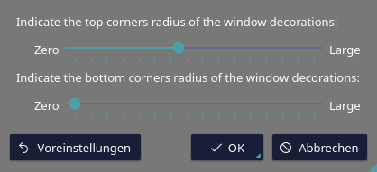

# Artic Night KDE
A set of themes for KDE Plasma

## Noitice
It's recommended, that you use [Blur - Respect Rounded Corners](https://github.com/aleasto/kwin-effects-blur-respect-rounded-decorations) instead of the default Blur.

When doing this, make sure to set the settings as shown below.



## How to install

Run these commands in your terminal:
```sh
git clone https://github.com/psyGamer/Arctic-Night-KDE.git
cd Arctic-Night-KDE

chmod +x ./install.sh
./install.sh
```

## How to update
If you've already install the themes and want to get the latest version run:

`./update.sh`

## How to uninstall
If you want to uninstall the themes run:

 `./uninstall.sh`

## Credits
- Window Decorations based on [Nova Pengi](https://github.com/varlesh/nova-kde/tree/pengi)
- Kvantum Theme based on [Sensual](https://github.com/L4ki/Sensual-Theme)
